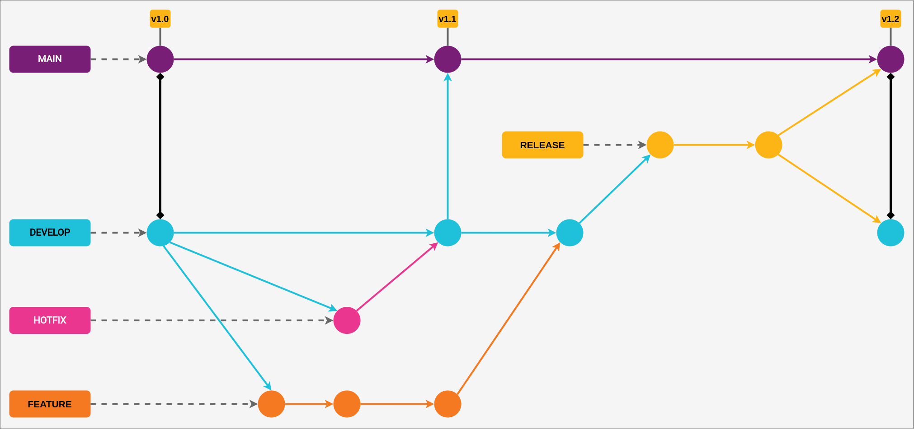

# Contributing

When contributing to this repository, please first discuss the change you wish to make via, [issue](https://github.com/padupe/script-validate-bs-integration/issues), email, or any other method with the owners of this
repository before making a change.

Please note we have a **Code of Conduct**, please follow it in all your interactions with the project.

---

## Index

- [Usefull commands](#usefull-commands)
- [Git Flow](#git-flow)
  - [General guidelines](#general-guidelines)
  - [Hotfix](#hotfix)
  - [Example flow](#example-flow)
- [Branches pattern](#branches-pattern)
- [Commit pattern](#commit-pattern)
- [Naming pattern](#naming-pattern)
  - [Files and folders](#files-and-folders)
  - [Classes, constants and functions](#classes-constants-and-functions)
- [Pull Request process](#pull-request-process)

---

## Usefull commands

Some scripts that can enhance your collaboration in this project:

| What? | Description |
| :--: | :-- |
| `yarn install` |  Install Project dependencies at your environment. |

---

## Git Flow

We follow the team development workflow called [**Git Flow**](https://nvie.com/posts/a-successful-git-branching-model/). In this section we indicate guidelines to guarantee the "integrity" of this flow.

### General guidelines

For the development of new _features_ or corrections **NOT EMERGENCY** to be carried out, the flow is presented below:

> This flow is the most common.

- 1 - New branches must be "born" from `develop`;

- 2 - After completion of development, register Pull Request to branch `develop`;

- 3 - After merge, your implementation will be validated in the development environment;

- 4 - If there is no problem/inconsistency, the new implementation will be "promoted" to release;

  - 4.1 - A new branch will be created from `develop` with the name `release/implementation_description`;

- 5 - A Pull Request from branch `release/implementation_description` for branches `main` and `develop` will be registered.

### Hotfix

Situations in which failures/inconsistencies are found that require immediate action by the development team, the flow is as follows:

- 1 - The branch for patch development "is born" from `main` with the name `hotfix/fix_description`;

- 2 - The validations occur in the `hotfix` branch itself;

- 3 - A _Pull Request_ from _branch_ `hotfix/fix_description` will be registered for branches `main` and `develop`.

### Example Flow

Visual sample flow from [Git Flow](https://nvie.com/posts/a-successful-git-branching-model/):

---

## Branches pattern

To carry out the development of a feature or even a fix, we recommend that the branches created follow the following pattern:

- English language;
- Type:
  - **build**: Changes that affect the project's build system;
  - **ci**: Changes to CI configuration scripts;
  - **docs**: Updates or additions will only be made in the context of documentations;
  - **feat**: A new feature or functionality will be developed;
  - **fix**: A fix will be performed;
  - **perf**: Code changes that improve project performance;
  - **refactor**: Changes to the code that change its structure, but are not related to bug fixes or new features;
  - **style**: Changes that do not affect the project's programming logic, such as removing whitespace, etc;
  - **test**: Addition of new tests or missing tests.
- Issue id;
- Brief summary of what will be developed/fixed in the branch.

**Example**: docs/100_contributing

---

## Commit pattern

We follow [Conventional Commits](https://www.conventionalcommits.org/en/v1.0.0/), which in summary follow the same principles highlighted in the [previous section](#branches-pattern). The addition is that we must inform the context in which the commit was performed. Below, more details about the basic structure for commits:

- English language;
- Type (build, ci, docs, feat, fix, perf, refactor, style or test);
- Context;
  - Indicating the path of the added or updated file;
- Commit message.

**Example**: `"docs(README.md): project documentation update."`

---

## Naming pattern

In this section we highlight guidelines for naming [**"files and folders"**](#files-and-folders), [**"classes, constants and functions"**](#classes-constants-and-functions) . It should be noted that for **all situations**, the English language must be adopted for the nomenclature.

### Files and folders

Files and folders must follow the **Kebab Case** pattern. That is, the words are separated by a hyphen (-).

Examples:

| What | Example |
| :--: | :--: |
| file | `app.ts` |
| folder | `directory-example` |

### Classes, constants and functions

Here are guidelines for naming **classes**, **components**, **constants** and **functions**:

Examples:

| What | Default | Description | Example |
| :---: | :---: | :---: | :---: |
| classes | **Pascal Case** | Match words by capitalizing all of the first letters. | `GitHubRepository` |
| constants and variables | **camelCase** | It must start with the first letter in lowercase and the first letter of each subsequent new word in uppercase. | `responseData` |
| functions | **camelCase** | It must start with the first letter in lowercase and the first letter of each subsequent new word in uppercase. | `getUser` |

**IMPORTANT**: _Interfaces_ follow the pattern **Pascal Case** (Combine words putting all with the first letter capitalized.). The "difference" is that they have the name starting with the letter "I". For example: `IGitHubRepository`.

---

## Pull Request process

1. We created a Pull Request template to direct the filling in of information, fill it in correctly to speed up the process.

2. Update the CHANGELOG.md with details of changes to the project, this includes new environment variables, documentation change, new functionality and usefull information to identify any possible breaking change.

3. Increase the version numbers of the package the new version that this Pull Request would represent. The versioning scheme we use is [SemVer](http://semver.org/).

4. Your Pull Request will be evaluated by the Project owner, pay attention to possible indications of corrections and/or adaptations in your code.
